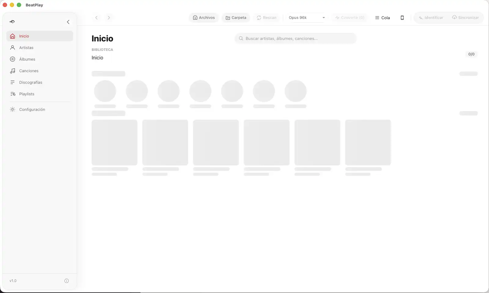

# BeatPlay Bridge

**The free Mac app that puts your music on iPhone and Apple Watch.**

No iTunes. No iCloud. No streaming required.

---

## What it does

BeatPlay Bridge is the macOS companion for [BeatPlay](https://beatplay.app) — the offline music player for iPhone and Apple Watch. It handles everything on the Mac side: import your audio files, convert them to a compact format, and transfer them to your iPhone over local Wi-Fi.

**How it works:**

1. **Import** — Drag your audio files into the Bridge. Any format FFmpeg supports works (MP3, FLAC, WAV, AAC, OGG, and more).
2. **Convert** — The Bridge converts everything to `.m4a` (AAC) automatically. Smaller files, same quality you'll actually hear.
3. **Transfer** — Send your selection to iPhone over local Wi-Fi. No cables. No iTunes. No cloud sync.
4. **Listen** — Open BeatPlay on iPhone and play offline.
5. **Sync** — Send songs to your Apple Watch and listen without your phone nearby.

---

## Download

Go to [**Releases**](../../releases) to download the latest version.

| Architecture | File |
|---|---|
| Apple Silicon (M1 and later) | `BeatPlay_x.x.x_aarch64.dmg` |
| Intel | `BeatPlay_x.x.x_x64.dmg` |

**Requirements:** macOS 13 Ventura or later.

---

## BeatPlay ecosystem

| App | Platform | Distribution |
|---|---|---|
| **BeatPlay Bridge** | macOS | Free — direct download (.dmg) |
| **BeatPlay** | iPhone | Free + Pro — [App Store](https://beatplay.app) |
| **BeatPlay** | Apple Watch | Included with iPhone app |

BeatPlay Bridge is free and has no in-app purchases. It is the entry point to the ecosystem.

---

## Notes

- BeatPlay Bridge requires the [BeatPlay iPhone app](https://beatplay.app) to transfer music.
- Audio conversion uses FFmpeg (GPL). See [FFmpeg license](https://ffmpeg.org/legal.html).
- No account, no telemetry, no internet connection required to use the app.
